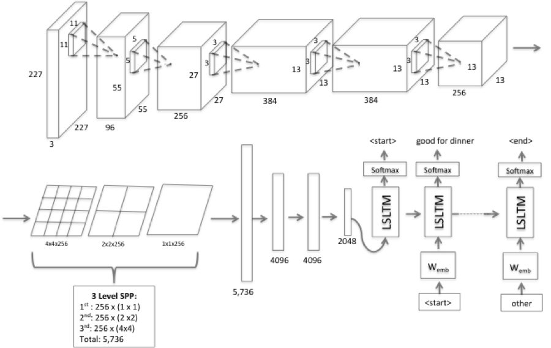
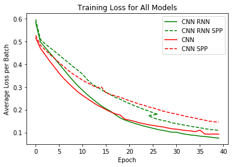
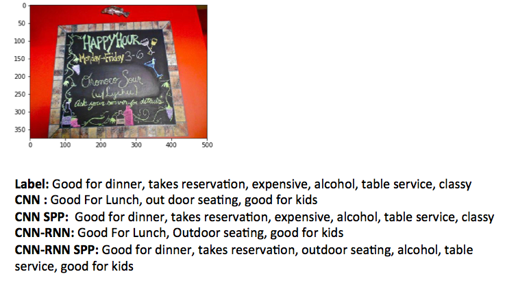
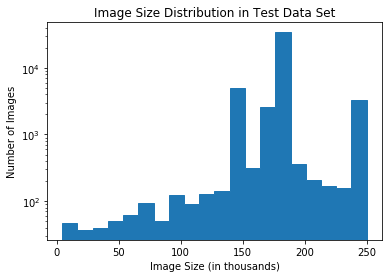

# Yelp Image Classification
Based on popular research that suggests Spatial Pyramid Pooling (SPP) layers improve the accuracy of Convolutional Neural Networks(CNN), we look to apply the same method on a CNN RNN(Recurrent Neural Network) framework with the aim to classify a Yelp Image Dataset.

## Dataset 

The data set used was leveraged from Kaggle and contains a total of 234, 842 images. These images were partitioned into training: 164,382 (~70\%), validation: 23,483 (~10\%), and test data: 46,977 (~20\%).  The purpose of the validation data is for hyper parameter tuning such that it dictates which learning rates, weight decay, embedding sizes, number of hidden units, and number of layers are optimal. The unique labels for the images are: \textit{good\_for\_lunch}, \textit{good\_for\_dinner}, \textit{takes\_reservations}, \textit{outdoor\_seating}, \textit{restaurant\_is\_expensive}, \textit{has\_alcohol}, \textit{has\_table\_service}, \textit{ambience\_is\_classy}, and \textit{good\_for\_kids}. For the CNN-RNN models <start>, <padding>, and <end> have also been included. Given the pretrained parameters, all images have been normalized considering the mean and standard deviation of the ImageNet dataset. Also, all images were resized to 227 x 227 for training, including the SPP models. This approach has been shown to maintain the benefit of SPP, while exploiting the benefits of training with fixed size images[3]. For testing purposes the images remained the same size for the SPP models using a batch size of 1.

## Model
Our proposed framework is below:

To execute this project, google colab was used with the train photos loaded onto our drive. Both the baseline CNN and CNN-RNN models were tuned for hyper parameters. Their counterparts which include the SPP layer, used the same hyper parameters and modified accordingly so that they could operate prooperly. All models were trained for 40 Epochs and can be found in the ML Models folder. Below are the training losses. 

Below is a summary of the results on the test data:

|             | Accuracy | Precision | Recall | F1 Score |
|-------------|----------|-----------|--------|----------|
| CNN         | 0.78     | 0.80      | 0.79   | 0.79     |
| CNN SPP     | 0.75     | 0.75      | 0.79   | 0.77     |
| CNN RNN     | 0.77     | 0.78      | 0.79   | 0.78     |
| CNN RNN SPP | 0.71     | 0.70      | 0.80   | 0.74     |

These results would suggest that there may be some limitation to incorporating an SPP layer and that it potentially should be viewed more as an image processing technique or hyper parameter. The idea from previous papers that suggest it improves all CNNs, may require further research. Below we explore further to see a sample image captioned by all the models. 

Interestingly, both base models under-perform here achieving 0\% accuracy . This would imply that SPP does aid in some cases; however, at the cost of more obvious paths.

## Further Research

The areas for further investigation include the number of bins, number of levels, and the limitation in image size variability. Regarding the latter, it was apparent that some images may be too small for an SPP layer such that some of our images would produce an error because by the final convolution, they were too small and unable to be partitioned into bins. It is also possible the number of bins and levels are a function of the variability of the sizes of the images such that an optimal bin number will properly reflect the max and min size of the image data set. Below is a distribution regarding our data:

